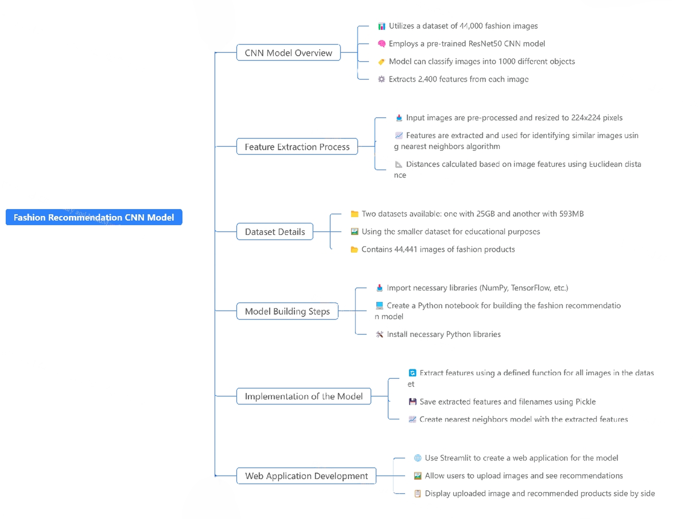

# AIStylist
Fashion Recommendation System using CNN

## Highlights
👗 **Introduction to CNN Recommendation Model**  
This project implements a Convolutional Neural Network (CNN) to provide personalized fashion item recommendations based on user-uploaded images.

📸 **Demo of the Web Application Functionality**  
Experience the interactive web application that showcases the model's capabilities in real-time.

🏷️ **Uploading and Processing Fashion Images**  
Users can easily upload fashion images for processing and recommendations.

🔍 **Feature Extraction using ResNet-50**  
The model utilizes ResNet-50 for extracting features from images, enabling effective comparisons and recommendations.

📊 **Nearest Neighbors Algorithm for Recommendations**  
Recommendations are generated using a nearest neighbors algorithm, ensuring relevant suggestions based on user input.

🌐 **Deployment as a Web Application with Streamlit**  
The application is deployed using Streamlit, providing a user-friendly interface for interaction.

✅ **Successful Model Recommendations for Various Fashion Items**  
The model successfully identifies and recommends similar fashion items based on the uploaded images.

## Key Insights
🤖 **CNN Applications**  
Convolutional Neural Networks are highly effective for image recognition tasks, making them ideal for fashion recommendations due to their ability to learn intricate features.

📈 **Pre-trained Models**  
Utilizing pre-trained models like ResNet-50 accelerates development by leveraging existing knowledge from large datasets, reducing the need for extensive computational resources.

🧩 **Feature Extraction**  
Extracting 2,400 features from each image allows the model to understand key attributes, enhancing its ability to recommend similar items.

📏 **Distance Metrics**  
The use of Euclidean distance in the nearest neighbors algorithm effectively identifies similar items, ensuring relevant recommendations based on user input.

🌍 **Web Application Deployment**  
Streamlit provides a simple way to develop and deploy machine learning models, making it accessible for developers without extensive web development experience.

📊 **User Interaction**  
The application allows users to upload images, demonstrating a practical interface that enhances user engagement with the model.

🛍️ **E-commerce Integration**  
This model can significantly improve user experience in e-commerce platforms by providing personalized recommendations, potentially increasing sales and customer satisfaction.

## Technologies Used
- **Python**: The primary programming language for model development.
- **Machine Learning Libraries**: Libraries such as TensorFlow and Keras for building and training the CNN model.
- **Streamlit**: For deploying the web application and creating an interactive user interface.

## Dataset
The dataset used for training the model can be found on Kaggle: [Fashion Dataset]([https://www.kaggle.com/datasets/your-dataset-link](https://www.kaggle.com/datasets/paramaggarwal/fashion-product-images-small))

## Project Flowchart

